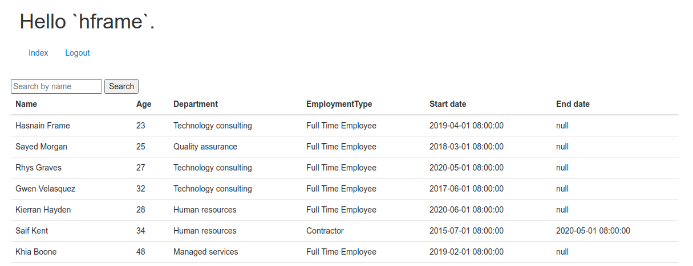
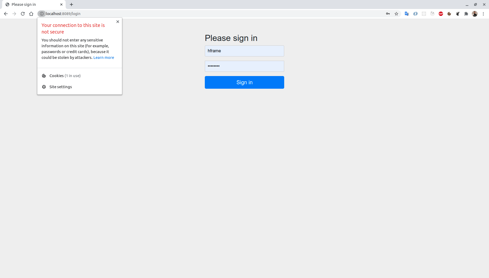
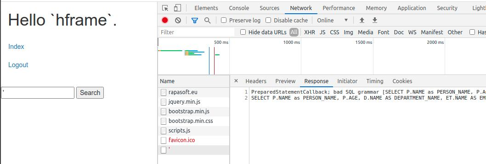
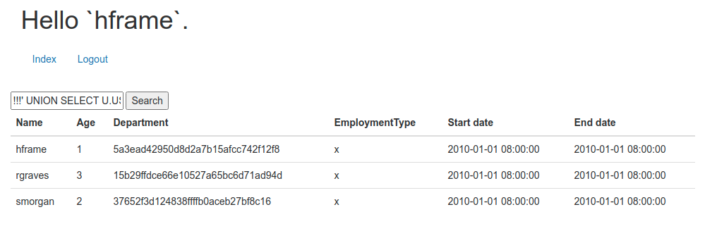
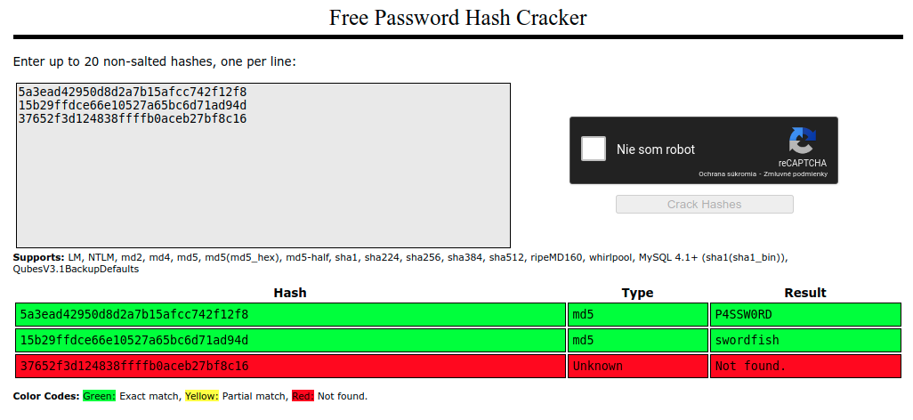
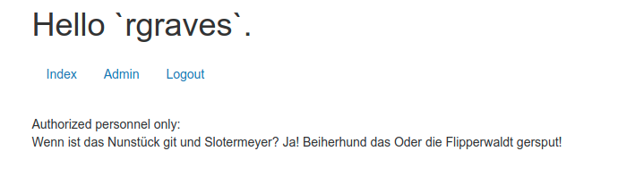

# How to hack unsecure web application

Tags: security, java

In this article I would like to demonstrate how easy it is to get confidential information from a web application that... well, doesn't pay too much attention to security. What I will be working with is a sample Java application that I created in Spring Boot for demonstration purposes. But the attacks performed are valid for any other programming language or framework. Some vulnerabilities and security issues that will be demonstrated include:

- SQL [Injection](https://owasp.org/www-project-top-ten/2017/A1_2017-Injection)
- [Sensitive data exposure](https://owasp.org/www-project-top-ten/2017/A3_2017-Sensitive_Data_Exposure)
- [Insufficient logging](https://owasp.org/www-project-top-ten/2017/A10_2017-Insufficient_Logging%2526Monitoring)
- [Broken authentication](https://owasp.org/www-project-top-ten/2017/A2_2017-Broken_Authentication)

## The setup

We will be working with a fictional web application that allows you to login as user which is a part of some group. Based on user role, he can view either standard or confidential data. In this case, you will see a list of employees in a company, their status, etc.

> You can find the sources to this application in my Github: [https://github.com/rapasoft/hackme](https://github.com/rapasoft/hackme).

## Attack #1: Man in the middle attack

Imagine you are sitting in a restaurant and would like to check something in the application above. You connect to restaurant's Wi-Fi, open the login page, enter credentials and obtain information you want (e.g. the list of specific employees). What you might not now, is that your credentials have been compromised. Let's examine the login page closely:

This application does not use SSL/TLS (e.g. no `https://` connection). This means, that any information sent can be viewed as plain text by anyone with access to communication between the client and server.

This is exactly what is happening in so called *Man in the middle attack*. More specifically, in this case [ARP spoofing](https://en.wikipedia.org/wiki/ARP_spoofing) has been used as a way to poison whole network so that attacker is aware of anything that goes on and can sniff on all packets. I am not going to go into details on how ARP spoofing works, but will demonstrate it on this video:

> You might need to open this Youtube video in a new window and full-screen to see more details

What you can see above is that I have started [Ettercap](https://www.ettercap-project.org/), which is a comprehensive suite for MITM attacks, and performed ARP spoofing in my local network. In the meantime, when user (me via iPad) enters the credentials, they are visible both in Ettercap and in [Wireshark](https://www.wireshark.org/) (tool for network traffic analysis).

## Attack #2: SQL Injection

Continuing our role as attacker of this application, we now have the credentials for user `hgraves` with password `P4SSW0RD`. You can see that not only this application does not use TLS, it has a very weak password policy enabling users chose really awful passwords.

We log in using the credentials above and can see one input field with option to search for list of people. When pressing `Search` we will get the full list of people. If we put "Fra" for instance we will get filtered results based on search. What if we put there some illegal character? It is obvious, that there's some database behind this application, so let's try the `'` character:

Not only did this fail, but we can see that `POST` request has failed with very specific error message that expose the structure of whole SQL statement. We can see that `WHERE P.NAME LIKE '%'%'` is used at the end. 

Skilled hacker does not need more. Adjusting the search string can after few attempts yield these results:

> The injection in this case created union to select statement that fetches usernames and passwords together with their role. Not only this was successful, we've managed to display it in the original client application.

We have now credentials of all users, and their roles (displayed by the integer in the "Age" column). If `hframe` has role 1, `rgraves` must therefore be more important user with role 3.

## Attack #3: Attacking weakly hashed passwords

We have learned in the first attack, that there probably isn't any password policy set for this application. This would give us hope that `rgraves` does not pay too much attention on security either.

The easiest way to crack hash of password that uses insufficient hashing algorithm (like MD5 in this case) is to perform [dictionary](https://en.wikipedia.org/wiki/Dictionary_attack) or [rainbow table](https://en.wikipedia.org/wiki/Rainbow_table) attack. There are many possibilities, but the easiest one is to use [internet services](https://crackstation.net/) that already have large database of password-to-hash combinations:

> First one is `hframe`, second one is `rgraves`. `smorgan` seems to be using stronger passwords than others, since it is not in the dictionary.

You can see that password for `rgraves` is [swordfish](https://www.imdb.com/title/tt0244244/), which means that he doesn't now how important it is to choose non-dictionary password ;). Now, nothing stops us from logging in as this user and discovering the "admin" section and confidential information:

> [Do not read this if you're German :)](https://www.youtube.com/watch?v=FBWr1KtnRcI)

## How to fix this?

You might say that all of this could be easily prevented. You might say that these were *rookie mistakes*. Well, this might be true, but what's also true is that [The Open Web Application Security Project](https://owasp.org/) lists *Injection* as #1 vulnerability in web applications (and it has been like this for several years).

So, if you found yourself wondering how to prevent all of this, let's recap:

- **Always use SSL/TLS when sending something to server**. It doesn't have to be credentials, it is currently considered as good practice in general. Even if you don't have any inputs on your page at all! The easiest way is to provide certificate via services like [Let's Encrypt](https://letsencrypt.org/).
- Remember that self-signed certificates might mitigate the issue of data exposure, but do not prevent from MITM attacker to fake the whole site with his own self-signed certificate altogether.
- When dealing with SQL queries **always escape parameters obtained from client**. The easiest way to do that is use capabilities of your framework, e.g. in Spring you can use [NamedParameterJdbcTemplate](https://docs.spring.io/spring-framework/docs/current/javadoc-api/org/springframework/jdbc/core/namedparam/NamedParameterJdbcTemplate.html) which is good for readability as well.
- **Be paranoid.** Validate any user input. Again in Java/Spring world you can add validation rules using `JSR-380` bean validation implementation like [Hibernate validator](https://hibernate.org/validator/) and annotate parameters, e.g. `@Pattern(regexp = "[a-z|A-Z]*") String name` would prevent entering `'`.
- Log any attempts to pass in invalid input in the application. Moreover, in case of error **do not expose any implementation-specific information** to the client.
- Improve your authentication. 
    - If possible use at least [2-factor authentication](https://en.wikipedia.org/wiki/Multi-factor_authentication).
    - Do not implement custom password storage or encryption algorithms. It is extremely difficult to do on your own and you will definitely fail. There're proven solutions like [BCrypt](https://en.wikipedia.org/wiki/Bcrypt).
- Read and bookmark [OWASP TOP 10](https://owasp.org/www-project-top-ten/). Start with there and then go through their list of best practices.

I hope you found this article not only informative but entertaining as well. Looking forward to your comments!